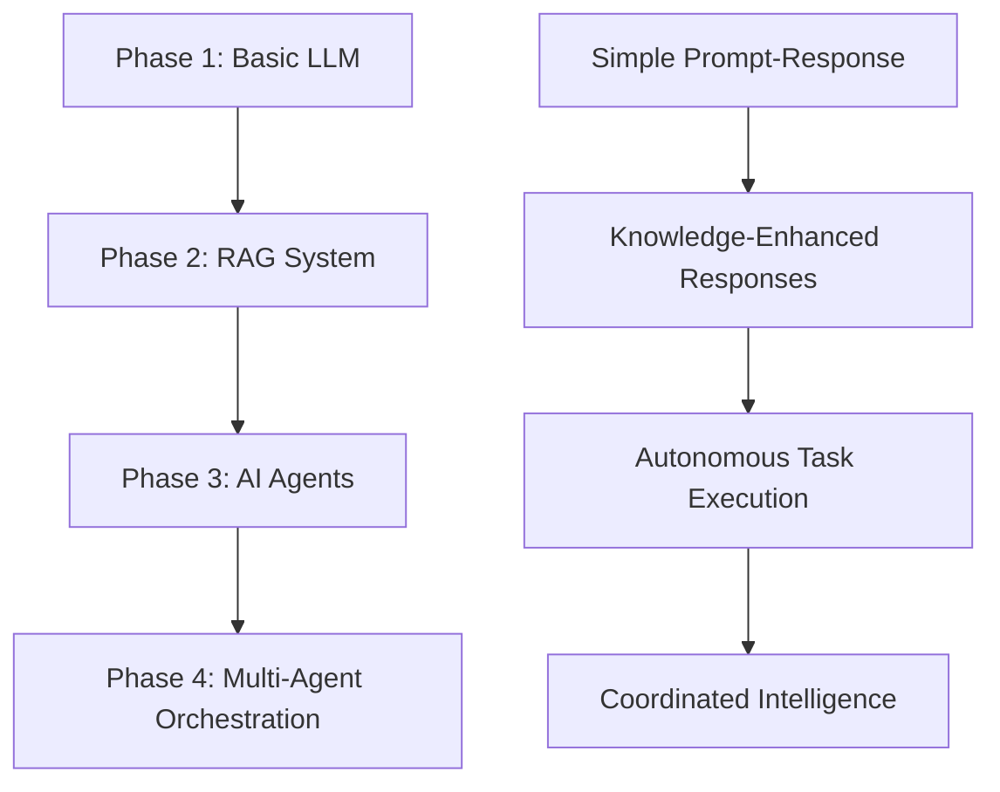

# AI Evolution Framework

A comprehensive implementation demonstrating the architectural evolution of AI systems from basic LLM workflows to sophisticated multi-agent orchestration, built specifically for Amazon Bedrock.

[](https://www.python.org/downloads/)
[](https://aws.amazon.com/bedrock/)
[](https://www.anthropic.com/claude)
[](https://aws.amazon.com/bedrock/titan/)
[](https://opensource.org/licenses/MIT)

## Overview

Built for the [Medium article series](https://blog.cloudbuckle.com/the-evolution-of-gen-ai-systems-from-simple-llms-to-agentic-ai-d45b6ec46aef) on AI system architecture evolution

This framework demonstrates the complete evolution of AI system architectures through four distinct phases, each building upon the previous to solve increasingly complex challenges. Built with production-ready code using Amazon Bedrock, Claude 3.5, and Titan embeddings.

### Architecture Evolution



## Features

### 🚀 **Production-Ready Implementation**
- Native Amazon Bedrock integration with proper error handling
- Cost tracking and optimization across all phases
- Comprehensive logging and monitoring
- Real-world performance benchmarks

### 🎯 **Four Complete Phases**
- **Phase 1**: Basic LLM workflows with conversation tracking
- **Phase 2**: RAG systems with Titan embeddings and vector search
- **Phase 3**: AI agents with intelligent tool selection
- **Phase 4**: Multi-agent orchestration with shared memory

### 💰 **Cost Optimization**
- Smart routing between Claude Sonnet (complex) and Haiku (simple)
- Real-time token usage tracking
- Cost estimation and budgeting tools
- Performance vs. cost analytics

### 📊 **Comprehensive Testing**
- Unit tests for all components
- Integration tests across phases
- Performance benchmarks
- Cost analysis tools

## Quick Start

### Prerequisites

```bash
# AWS CLI configured with Bedrock access
aws configure

# Python 3.8 or higher
python --version

# Bedrock model access enabled in AWS Console
```

### Installation

```bash
# Clone the repository
git clone https://github.com/yourusername/ai-evolution-framework.git
cd ai-evolution-framework

# Create virtual environment
python -m venv .venv
source .venv/bin/activate  # On Windows: .venv\Scripts\activate

# Install dependencies
pip install -r requirements.txt

# Verify AWS Bedrock access
make verify-access
```

### Run Demonstrations

```bash
# Complete evolution demonstration
python demo_phase1_bedrock.py
python demo_phase2_bedrock.py
python demo_phase3_bedrock.py
python demo_phase4_bedrock_clean.py

# Or run all phases
make demo-all
```

## Architecture Deep Dive

### Phase 1: Basic LLM Workflow
Direct integration with Claude 3.5 via Bedrock, demonstrating fundamental prompt-response patterns with conversation tracking.

```python
from src.phase1_llm_workflow.bedrock_llm_client import BedrockLLMClient

client = BedrockLLMClient(model_id="anthropic.claude-3-5-haiku-20241022-v1:0")
response = client.invoke("Explain quantum computing in simple terms")
```

### Phase 2: RAG with Titan Embeddings
Knowledge-enhanced responses using Amazon Titan Embed Text v2 for high-dimensional semantic search.

```python
from src.phase2_rag.bedrock_rag_system import BedrockRAGSystem

rag_system = BedrockRAGSystem(
    llm_model_id="anthropic.claude-3-5-sonnet-20241022-v2:0",
    embedding_model_id="amazon.titan-embed-text-v2:0"
)
rag_system.load_knowledge_base(documents)
result = rag_system.query("How does RAG improve AI responses?")
```

### Phase 3: Bedrock-Optimized Agents
Intelligent agents that use Claude's reasoning capabilities for tool selection and task execution.

```python
from src.phase3_agents.bedrock_agent_executor import BedrockToolAgent

agent = BedrockToolAgent("ProductionAgent")
response = agent.process("Calculate compound interest on $10,000 at 5% for 3 years")
```

### Phase 4: Multi-Agent Orchestration
Coordinated intelligence with specialized agents working together through shared memory and intelligent routing.

```python
from src.phase4_agentic.bedrock_orchestrator_clean import BedrockAgentOrchestrator

orchestrator = BedrockAgentOrchestrator()
result = await orchestrator.process_request(
    "Analyze market trends and provide optimization recommendations"
)
```

## Project Structure

```
ai-evolution-framework/
├── src/
│   ├── phase1_llm_workflow/       # Basic LLM patterns
│   ├── phase2_rag/                # RAG with Titan embeddings
│   ├── phase3_agents/             # Intelligent agents
│   ├── phase4_agentic/            # Multi-agent orchestration
│   └── common/                    # Shared utilities
├── tests/                         # Comprehensive test suite
├── examples/                      # Demo scripts and examples
├── docs/                          # Documentation
└── monitoring/                    # Performance tracking
```

## Performance Benchmarks

Based on comprehensive testing with Amazon Bedrock:

| Phase | Avg Response Time | Throughput | Cost per 1K Tokens | Use Case |
|-------|------------------|------------|-------------------|----------|
| Phase 1 | ~150ms | High | $0.00025-$0.015 | Simple Q&A |
| Phase 2 | ~300ms | Medium | $0.0001-$0.015 | Knowledge-based responses |
| Phase 3 | ~450ms | Medium | $0.00025-$0.015 | Task automation |
| Phase 4 | ~600ms | Lower | $0.00075-$0.045 | Complex coordination |

*Costs vary based on Claude Haiku vs Sonnet usage and token volume*

## Cost Optimization

### Smart Model Routing
```python
# Automatic routing based on complexity
if complexity_score < 0.3:
    model = "anthropic.claude-3-5-haiku-20241022-v1:0"  # $0.25/$1.25 per 1K tokens
else:
    model = "anthropic.claude-3-5-sonnet-20241022-v2:0"  # $3/$15 per 1K tokens
```

### Usage Monitoring
```bash
# Real-time cost tracking
make cost-estimate
make usage-stats

# Set cost limits
export MAX_DAILY_COST=10.00
```

## Testing

```bash
# Run all tests
make test

# Run specific phase tests
python -m pytest tests/test_phase1_llm.py -v
python -m pytest tests/test_phase2_rag.py -v
python -m pytest tests/test_phase3_agents.py -v
python -m pytest tests/test_phase4_bedrock.py -v

# Performance benchmarks
make test-performance
```

## Production Deployment

### AWS Setup
```bash
# Configure Bedrock access
aws bedrock list-foundation-models --region us-east-1

# Set up IAM permissions
aws iam attach-role-policy \
  --role-name YourRole \
  --policy-arn arn:aws:iam::aws:policy/AmazonBedrockFullAccess
```

### Environment Configuration
```bash
# Required environment variables
export AWS_DEFAULT_REGION=us-east-1
export BEDROCK_MODEL_REGION=us-east-1
export MAX_TOKENS_PER_REQUEST=1000
export COST_TRACKING_ENABLED=true
```

### Docker Deployment
```bash
# Build container
docker build -t ai-evolution-framework .

# Run with AWS credentials
docker run -e AWS_ACCESS_KEY_ID -e AWS_SECRET_ACCESS_KEY ai-evolution-framework
```

## Contributing

We welcome contributions! Please see our [Contributing Guide](CONTRIBUTING.md) for details.

### Development Setup
```bash
# Install development dependencies
make install-dev

# Run code quality checks
make lint
make format

# Run full test suite
make test-all
```

### Code Quality Standards
- Type hints for all public functions
- Comprehensive docstrings
- 90%+ test coverage
- Performance benchmarks for new features

## Monitoring and Observability

### Built-in Metrics
- Token usage and cost tracking
- Response time monitoring
- Agent coordination analytics
- Memory usage optimization

### Integration Options
- CloudWatch metrics export
- Custom monitoring dashboards
- Cost alerting and budgets
- Performance trend analysis

## Troubleshooting

### Common Issues

**Model Access Denied**
```bash
# Request model access in AWS Console
# Bedrock > Model access > Request access
```

**High Costs**
```bash
# Check usage patterns
make usage-analytics

# Optimize model routing
export COMPLEXITY_THRESHOLD=0.5  # Route more to Haiku
```

**Performance Issues**
```bash
# Enable caching
export ENABLE_RESPONSE_CACHE=true

# Optimize concurrency
export MAX_CONCURRENT_REQUESTS=10
```

## Roadmap

- [ ] **Multi-region deployment** support
- [ ] **Agent learning** from interaction history
- [ ] **Custom model fine-tuning** integration
- [ ] **Advanced cost optimization** with ML-based routing
- [ ] **Integration** with other AWS AI services
- [ ] **Production monitoring** dashboard

## License

This project is licensed under the GNU General Public License v3.0 - see the [LICENSE](LICENSE) file for details.

## Acknowledgments

- Built for the [Medium article series](https://blog.cloudbuckle.com/the-evolution-of-gen-ai-systems-from-simple-llms-to-agentic-ai-d45b6ec46aef) on AI system architecture evolution
- Utilizes Amazon Bedrock's managed AI infrastructure
- Demonstrates production-ready patterns for enterprise AI applications

## Support

- 📖 **Documentation**: Comprehensive guides in the source code docstrings
- 🐛 **Issues**: Report bugs via GitHub Issues
- 💬 **Discussions**: Join our GitHub Discussions for questions and ideas
- 📧 **Contact**: [contact@cloudbuckle.com]

## Citation

If you use this framework in your research or projects, please cite:

```bibtex
@misc{gen-ai-evolution,
  title={AI Evolution Framework: From Basic LLMs to Multi-Agent Systems},
  author={Ramesh Nori},
  year={2025},
  publisher={GitHub},
  howpublished={\url{https://github.com/cloudbuckle-community/gen-ai-evolution}}
}
```

---

**Star this repository if it helped you understand AI system architecture evolution!**
